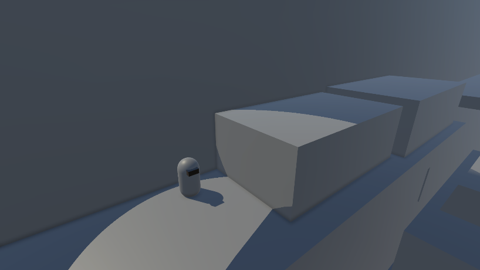
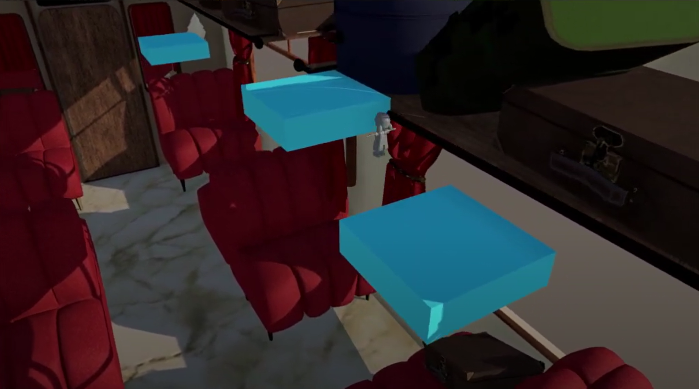
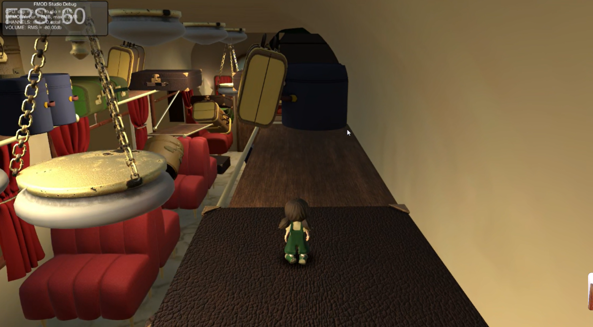
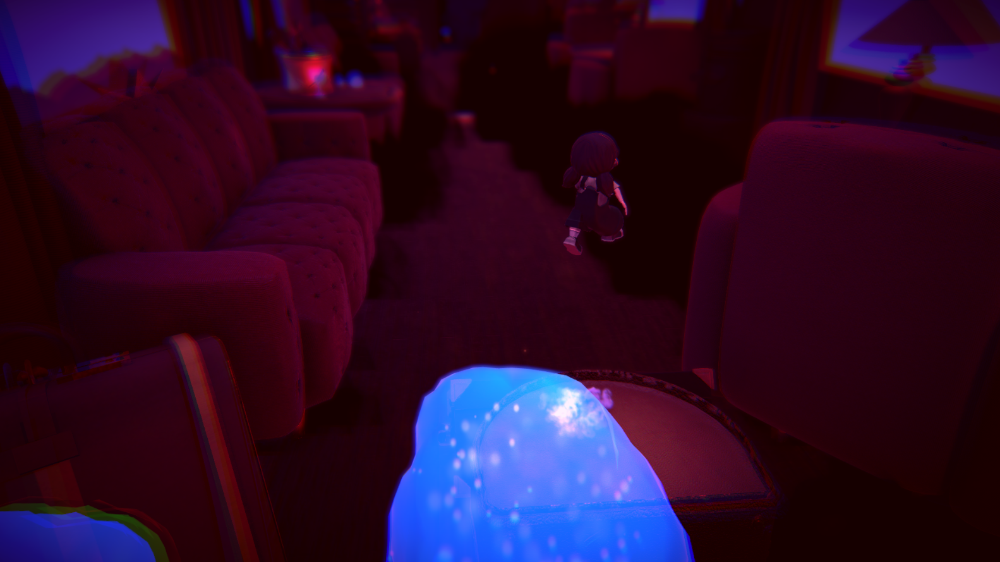

# Soul's Passage Process

|       Prototype       |         Alpha        |        Beta          | Gold |
|-----------------------|----------------------|----------------------|------|
|  |  |  |  |

# Index

## 1. Introduction
This project was developed as a university project by a team of 5 people in a period of time of 3 month.

Play as Chiara, a little girl trapped in a magical train. Your mission is to escape the train with the skills she has learned. 

- **Genre:**
  - 3D platformer game developed in Unity.  
- **Contribution:**  
  - Developed and tested the player controller using an FSM to handle player states.  
  - Conducted functional, negative, and exploratory tests for player abilities.  
  - Created a tool to save and teleport to specific map locations for optimized level testing.  
- **Insights:**  
  - Integrated FMOD for sound design.  
  - Explored Cinemachine for improved camera composition.

## 2. Team
- Laura Tuxans - Producer | Artist
- Grazielly Sanchez - Designer | Artist
- Paola Pica - Designer | Artist
- Gerard Martínez - Designer
- Camilo Londoño (Me) - Programmer

## 3. Systems and Features

### Character Controller with FSM
#### Description
I developed a Character Controller using a State Pattern to manage which actions can be triggered at any given time. Prior to implementing this system, I relied on a series of if-statements. For every new action added to the game, I had to create additional if-statements to determine which actions were allowed in each scenario, which quickly became complex.

Although this State Pattern-based system is relatively simple, refactoring the entire Character Controller to use it significantly streamlined testing and made it easier to modify values. For instance, during production, if designers wanted to enable an action in a state that previously did not allow it, or vice versa, this system facilitated those changes with minimal effort.

#### Technical Details
- **Repository:** [Souls Passage Repository](https://github.com/DarkAlejoxD/SoulsPassage_Code/tree/main/Assets/Scripts)

- **Using:**
  - FSM (GitHub Page in Progress)
  

### LedgeGrab
Describe cómo funciona el sistema de **LedgeGrab**:  
- ¿Qué es? (Por ejemplo: Permite al personaje agarrarse a bordes y moverse con fluidez).
- Cómo se implementó. (Breve explicación del uso de la FSM y los estados involucrados).
- Retos y soluciones. (Si hubo problemas, describe cómo los resolviste).

### Character Abilities
#### Ghost View
- **Descripción:** Explica en qué consiste esta habilidad (por ejemplo: "Permite al jugador ver a través de objetos para planificar su siguiente movimiento").
- **Detalles técnicos:** Breve descripción del enfoque usado (por ejemplo: Raycasts o cambio de materiales).
- **Uso:** Dónde se aplica esta habilidad en el juego.

##### Poltergeist
- **Descripción:** Define la habilidad (por ejemplo: "Permite mover objetos a distancia").
- **Detalles técnicos:** Describe la lógica detrás (como fuerzas físicas o interacciones específicas con colliders).
- **Casos de uso:** Ejemplos de cómo mejora la jugabilidad.

---

### Camera Controller
- **Propósito:** Explica el objetivo del sistema (por ejemplo: "Proveer una cámara fluida que siga al jugador y se adapte a diferentes escenarios").  
- **Características principales:**  
  - Adaptación a cambios de estado del jugador.  
  - Uso de Cinemachine o lógica personalizada.
- **Retos superados:** Describe cualquier desafío técnico y cómo lo solucionaste.

---

### Event System / Mechanism System
- **Propósito:** Breve introducción (por ejemplo: "Gestión de eventos interactivos como puertas, trampas o puzzles").  
- **Arquitectura:** Cómo está estructurado el sistema (por ejemplo, uso de un patrón Observer).  
- **Ejemplo:** Describe un caso práctico (como abrir una puerta al activar un interruptor).  

---

### Shaders
#### Transparency Shader
- **Descripción:** Qué hace el shader (por ejemplo: "Permite que ciertos objetos se vuelvan parcialmente transparentes al bloquear la vista del jugador").  
- **Detalles técnicos:** Breve explicación del enfoque (como máscaras de profundidad o cambio de alfa).  

#### Poltergeist Sphere Shader
- **Descripción:** Define el propósito (por ejemplo: "Crea un efecto visual cuando un objeto es manipulado con la habilidad Poltergeist").  
- **Detalles técnicos:** Incluye una breve descripción de los nodos o funciones principales usadas en el shader.  

---

## Conclusion
- Resume brevemente cómo estas características juntas hacen que el juego sea único.  
- Menciona cualquier aprendizaje o mejora futura que te gustaría implementar.
