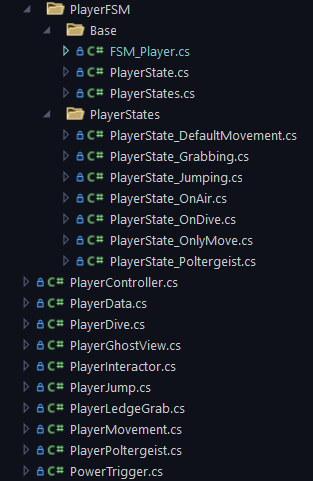
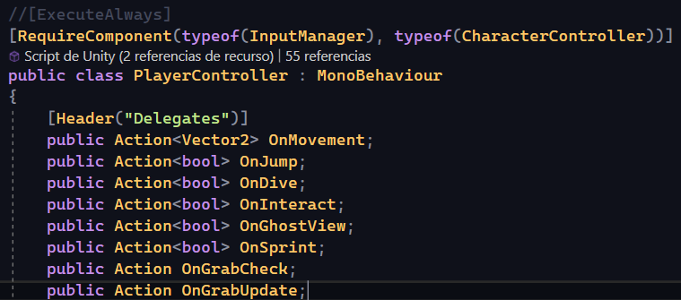
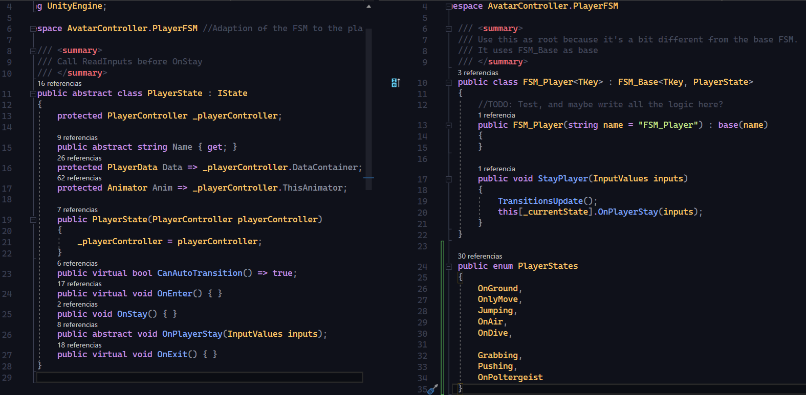
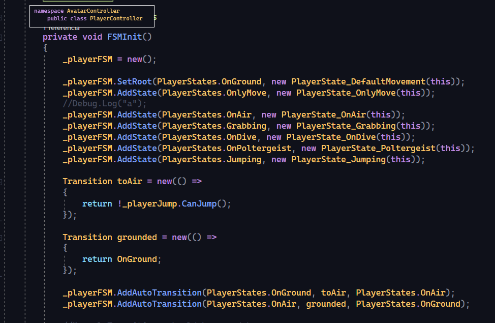

# Soul's Passage process

|       Prototype       |         Alpha        |        Beta          | Gold |
|-----------------------|----------------------|----------------------|------|
|  |  |  |  |

# Index

## 1. Introduction
This project was developed as a university project by a team of 5 people in a period of time of 3 month.

Play as Chiara, a little girl trapped in a magical train. Your mission is to escape the train with the skills she has learned. 

- **Repository:** [Souls Passage Repository](https://github.com/DarkAlejoxD/SoulsPassage_Code/tree/main/Assets/Scripts)

- **Genre:**
  - 3D platformer game developed in Unity.  
- **Contribution:**  
  - Developed and tested the player controller using an FSM to handle player states.  
  - Conducted functional, negative, and exploratory tests for player abilities.  
  - Created a tool to save and teleport to specific map locations for optimized level testing.  
- **Insights:**  
  - Integrated FMOD for sound design.  
  - Explored Cinemachine for improved camera composition.

## 2. Team
- Laura Tuxans - Producer | Artist
- Grazielly Sanchez - Designer | Artist
- Paola Pica - Designer | Artist
- Gerard Martínez - Designer
- Camilo Londoño (Me) - Programmer

## 3. Systems and Features

### Character Controller with FSM
#### Description
I developed a Character Controller using a State Pattern to manage which actions can be triggered at any given time. Prior to implementing this system, I relied on a series of if-statements. For every new action added to the game, I had to create additional if-statements to determine which actions were allowed in each scenario, which quickly became complex.

Although this State Pattern-based system is relatively simple, refactoring the entire Character Controller to use it significantly streamlined testing and made it easier to modify values. For instance, during production, if designers wanted to enable an action in a state that previously did not allow it, or vice versa, this system facilitated those changes with minimal effort.

#### Technical Details

In this system, there are various components acting:

| Image | Description |
|-|-|
|  | **Player Scripts:** <br><br>All the scripts used for the CharacterController are designed to encapsulate each feature into separate files. |
|  | **Player Actions:** <br><br>All actions are controlled by the observer pattern. If the corresponding component is not subscribed, it should not interrupt the execution flow. <br>An example of this is the PlayerJump.cs component, which has access to PlayerController.OnJump and subscribes to it to handle jump-related events. |
|  | **Player FSM & PlayerStates:** <br><br>The FSM takes advantage of a system I previously developed "_(GitHub Page in Progress)_", with a slight modification to its constructor to accept inputs through a class named _InputValues.cs_, which contains all actions performed during the current frame.|
|  | **Player FSM Initialization:** <br><br>FSM initialization. |

Each PlayerState contains relevant information about the player's current status and the animations associated with that state. For example:

##### PlayerState_DefaultMovement
```csharp
using InputController;
using UnityEngine;

namespace AvatarController.PlayerFSM
{
    /// <summary>
    /// FreeMove, the regular state of the player
    /// </summary>
    public class PlayerState_DefaultMovement : PlayerState
    {
        private const string MOVEMENT_VALUE = "Speed";
        private const string ONGROUND_ANIM = "OnGround";
        private const string AFK_ON_TRIGGER = "AFKon";
        private const string AFK_OFF_TRIGGER = "AFKoff";
        private const float SMOOTH = 0.3f;

        private float _animControl = 0;

        private float _timeToIdle = 0;
        private float _timeControl = 0;
        private float _jumpTimeControl = 0;

        private bool _poltergeistActivated;
        private bool _isAFK;
        private bool _canJump;

        public override string Name => "Default Movement";
        private bool IsAFK {...}
        private bool IsTrigger {...}

        public PlayerState_DefaultMovement(PlayerController playerController) : base(playerController)
        {
            _poltergeistActivated = false;
        }

        public override void OnEnter()
        {
            _playerController.UnBlockMovement();
            //If necessary change the playerMovementData
            _poltergeistActivated = false;

            if (Anim)
                Anim.SetBool(ONGROUND_ANIM, true);

            _isAFK = false;
            _timeControl = 0;
            _timeToIdle = Data.DefOtherValues.TimeBreakIdle;
            _jumpTimeControl = Time.time;
        }

        public override void OnPlayerStay(InputValues inputs)
        {
            if (_timeControl > _timeToIdle)
            {
                _timeControl = 0;
                _timeToIdle = Data.DefOtherValues.TimeBreakIdle;
                if (Anim)
                    Anim.SetTrigger(AFK_ON_TRIGGER);
            }

            //if (_playerController.Velocity.magnitude > Data.DefaultMovement.MinSpeedToMove)
            if (inputs.MoveInput.magnitude > 0)
            {
                _timeControl = 0;
                if (Anim && IsAFK)
                    Anim.SetTrigger(AFK_OFF_TRIGGER);
                if (!IsAFK && Anim)
                    Anim.ResetTrigger(AFK_OFF_TRIGGER);
            }
            _timeControl += Time.deltaTime;

            //Debug.Log($"BreakTime: {_timeControl}");

            //Anim Logic
            if (Anim)
            {
                // 0----min(x)----max(y)
                float speed = _playerController.Velocity.magnitude;
                float minSpeed = Data.DefaultMovement.MinSpeedToMove;
                float maxSpeed = Data.DefaultMovement.MaxSpeed;
                float value;

                //min(0) ---- max(y-x)
                maxSpeed -= minSpeed;
                speed -= minSpeed;
                value = speed / maxSpeed;
                value = Mathf.Clamp01(value);
                _animControl = Mathf.Lerp(_animControl, value, SMOOTH);

                Anim.SetFloat(MOVEMENT_VALUE, _animControl);
            }

            //Inputs Logic
            _playerController.OnMovement?.Invoke(inputs.MoveInput);
            if (Time.time > _jumpTimeControl + Data.DefaultJumpValues.JumpCD)
                _playerController.OnJump?.Invoke(inputs.JumpInput);

            //_playerController.OnDive?.Invoke(inputs.CrounchDiveInput);
            //_playerController.OnInteract?.Invoke(inputs.InteractInput);

            if (Data.Powers.HasGhostView)
                _playerController.OnGhostView?.Invoke(inputs.GhostViewInput);

            if (!Data.Powers.HasPoltergeist)
                return;

            if (inputs.Poltergeist && !_poltergeistActivated &&
                _playerController._canActivatePoltergeist)
            {
                _poltergeistActivated = true;
                _playerController.RequestChangeState(PlayerStates.OnPoltergeist);
            }
        }

        public override void OnExit()
        {
            base.OnExit();

            if (Anim)
            {
                Anim.SetBool(ONGROUND_ANIM, false);
                Anim.ResetTrigger(AFK_ON_TRIGGER);
                Anim.ResetTrigger(AFK_OFF_TRIGGER);
            }
            _isAFK = false;
        }
    }
}
```


In the _PlayerState_X.OnPlayerState(...)_ function, I implement the logic for the current state and define the actions that can be performed.


```csharp
        public override void OnPlayerStay(InputValues inputs)
        {
            if (Data.Powers.HasGhostView)
                _playerController.OnGhostView?.Invoke(inputs.GhostViewInput);

            if (_characterController.isGrounded) //Maybe send a raycast?
                _playerController.RequestChangeState(PlayerStates.OnGround);

            else
                _playerController.RequestChangeState(PlayerStates.OnAir);

            if (_playerController.CanGrab)
                _playerController.OnGrabCheck?.Invoke();

            _playerController.OnDive?.Invoke(inputs.CrounchDiveInput); // Comment or delete if this state doesn't need this action
            _playerController.OnJump?.Invoke(inputs.JumpInput); // Comment or delete if this state doesn't need this action
            _playerController.OnMovement?.Invoke(inputs.MoveInput); // Comment or delete if this state doesn't need this action
            
        }
```

### LedgeGrab
This system allows the player to grab onto certain ledges.
I chose to describe this system not because of its complexity, but because it was a significant challenge to make the mechanic function reliably. Below, I will explain some of the problems I encountered and how I solved them.

Initially, I aimed to allow the player to grab any ledge in the game. However, when designers introduced models with complex meshes or rotated objects, the system became buggy. To address this, we restricted the mechanic to specific invisible surfaces with simple collision detection, ensuring consistent performance and avoiding unnecessary complications.

(WIP)
TODO: Show images and code of the ledge grab system showing how is setted.

### Character Abilities
#### Ghost View
The Ghost View ability is initially locked. Once unlocked, it allows the player to activate the power and see, as well as stand on, invisible platforms.
(WIP)

##### Poltergeist
The Poltergeist ability allows the player to enter Poltergeist mode, where they can select and manipulate movable items, such as drawers or a pile of plates, to reach new paths.
(WIP)

---

### Camera Controller
Using Cinemachine, the setup is based on trigger areas that change the current camera on the CinemachineBrain. Additionally, if the player exceeds the screen boundaries, a security virtual camera is activated to keep the player always visible.
(WIP)

---

### Event System / Mechanism System
Observer Pattern-based. The activators (triggers, buttons, etc.) and mechanisms (objects that can be activated) subscribe to the MechanismManager (instance, not singleton).
(WIP)

---

### Shaders
#### Transparency Shader
Developed a shader using the stencil buffer that allows the player to see through walls when objects obstruct the avatar's vision.
(WIP)  

#### Poltergeist Sphere Shader
Developed a shader using the stencil buffer that reveals a different view of the wall only through specific objects. It is used for the Poltergeist Sphere when the ability is activated.
(WIP)

---
