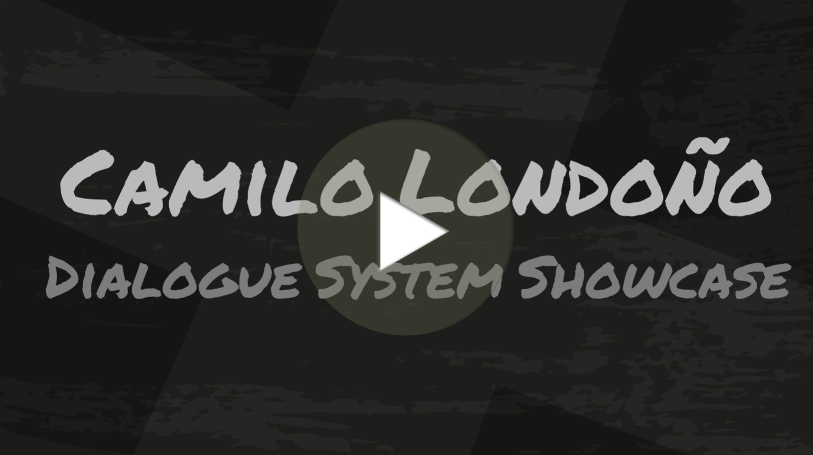

# Camilo Alejandro Londoño Otero  

## 🌟 About Me  
I am a developer with a passion for continuous **learning** and **improving** game development processes.  
My goal is to pursue a career as a **Gameplay Programmer**, bringing games to life.  
Experienced in developing **2D and 3D puzzle and platform games in Unity**.

---

## 🛠️ Technical Skills  
- **Game Engines:**  
  Unity | Defold | Love2D | Unreal Engine  
- **Programming Languages:**  
  C# | Lua  
- **Design Patterns:**  
  Singleton | Observer | State | Object Pooling | SOLID Principles  
- **Version Control:**  
  GitHub (proficient in managing branches and resolving conflicts)

---

## 🎮 Projects  

### [Soul's Passage | 2024](https://lauratux.itch.io/souls-passage) - [See Process](Projects/SoulsPassage)  
  

Play as Chiara, a little girl trapped in a magical train. Your mission is to escape the train with the skills she has learned.  

- **Genre:**
  - 3D platformer game developed in Unity.  
- **Contribution:**  
  - Developed and tested the player controller using an FSM to handle player states.  
  - Conducted functional, negative, and exploratory tests for player abilities.  
  - Created a tool to save and teleport to specific map locations for optimized level testing.  
- **Insights:**  
  - Integrated FMOD for sound design.  
  - Explored Cinemachine for improved camera composition.  

---

### [Osiris | 2023](https://capita333.itch.io/osiris) - (Process Page in Progress)
  

Embark on an adventure through a dungeon, solving puzzles and overcoming obstacles as Isis searches for her lost husband.  

- **Genre:**
  - 2D puzzle-platformer game developed in Unity.  
- **Contribution:**  
  - Designed the player controller, portal mechanics, level system, and hazards.  
- **Insights:**  
  - Collaborated with a programming partner and practiced task delegation.  
  - Gained experience using Render Textures.

---

### Requiem | Unrealeased - _(Process Page in Progress)_
  

Personal Project I collaborated on with five other members.
"Requiem" is a survival horror game where you play as a blind character navigating a dark and solitary shopping mall.
You must explore the mall, evade and hide from creatures stalking you, and solve puzzles to escape.

- **Genre:**
  - 2D survival horror game developed in Unity.
- **Contribution:**  
  - Designed all the PlayerController.
  - Designed the enemyController using FSM.
  - Integrated A* Project by Aron Granberg.
- **Insights:**  
  - Gained a deeper understanding of the A* algorithm and its practical applications.
  - Learned to use enum flags for state management.
---

## 🕹️ Game Jams  

### [Weight For It | GMTK 2024](https://aran-piris.itch.io/weigh-for-it)  

Test your skills in this thrilling game show where every gram counts.  

- **Genre:**
  - 2D arcade game developed in Unity.  
- **Contribution:**  
  - Improved the dialogue system from _Atka_ and contributed to the game loop and object escalation mechanics.  
- **Insights:**  
  - Learned from the working styles of other programmers and discovered useful tools they employed.

---

### [Atka | Tecnojam 2024](https://lauratux.itch.io/atka)  

_Atka_ follows Lilith, a volunteer studying the Inuit tribe.  
With her translator Ana, she uncovers mysteries hidden in the research project.  

- **Genre:**
  - 3D narrative adventure game developed in Unity.  
- **Contribution:**  
  - Built the dialogue system from scratch.  
  - Created a cheat system to accelerate testing of advanced game stages without replaying the full game.  
- **Insights:**  
  - Introduced to Custom Editor Scripts to facilitate dialogue creation.

---

### [Catadex (prototype) | Premis Ludi 2024](https://elix03.itch.io/catadex)  

A serious game showcasing the value of the Catalan language.  

- **Genre:**
  - 2D serious game developed in Unity.  
- **Contribution:**  
  - Implemented the game loop, card system, and animations.  
- **Insights:**  
  - Utilized PlayerPrefs for saving and exported the game to WebGL.

---

### [Tecnocampus Life | Lovejam 2022](https://darkalejo.itch.io/tecnocamper-simulator)

Navigate the tumultuous world of university life, balancing academics, mental well-being, social connections, and finances.  

- **Genre:** 2D Reigns-like game developed in Love2D.  
- **Contribution:**  
  - Sole programmer. Designed and implemented the card system, game loop, and ending events.  
- **Insights:**  
  - Explored the use of JSON files for data management and their impact on performance.

---

## 🛠️ Features & Systems
In this section, I will eventually upload systems I have developed that are reusable in future projects.

### Dialogue Manager
Dialogue Manager developed for _Atka_ and reused in _Weight For It_ to facilitate the creation of dialogues.

[DialogueSystem Video | Click on the Image](https://youtu.be/9chJTeLUDa4)

---

Feel free to explore my work navigating by my public repositories and reach out if you’d like to collaborate or have any questions!
